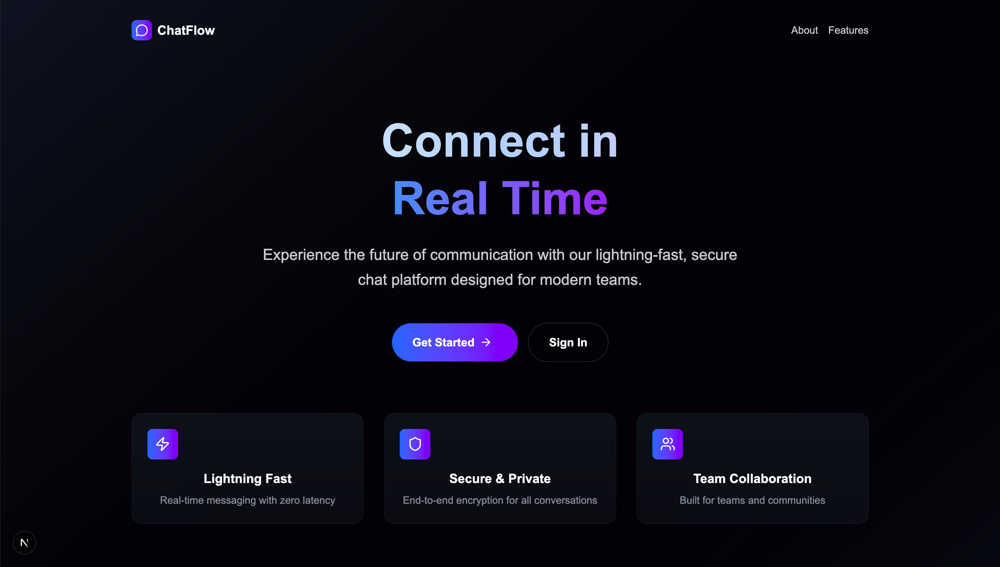
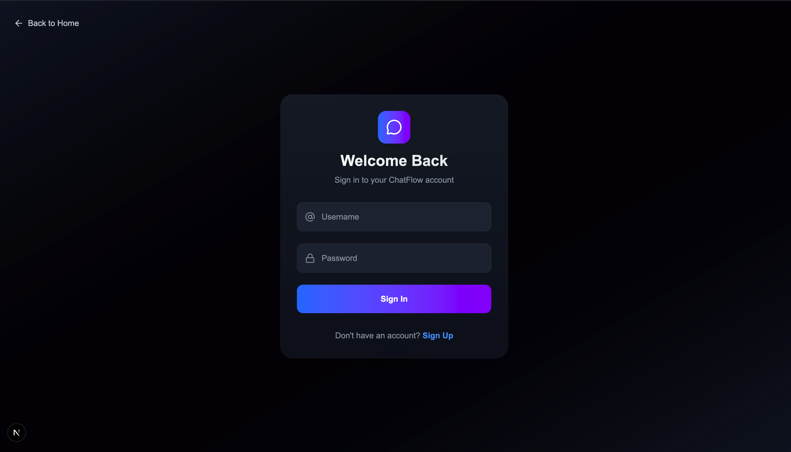
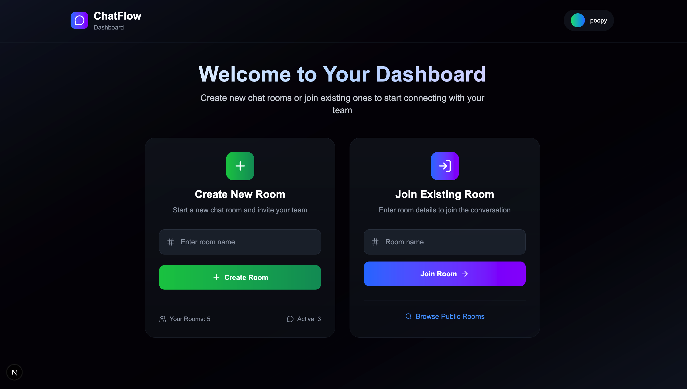
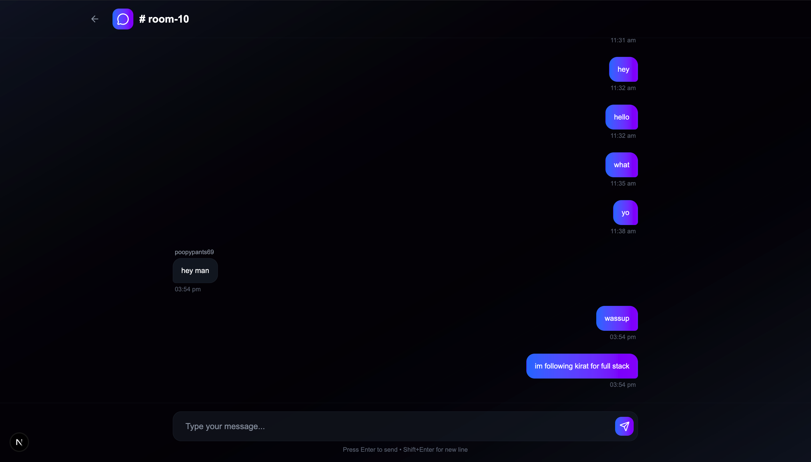

# Chatflow 💬

A real-time chat application built from scratch to explore WebSocket technology and Turborepo monorepo workflows. Chatflow allows users to create rooms and engage in seamless real-time conversations.

## 📸 Application Screenshots

### Home Page



### Sign In

# Chatflow 💬

A real-time chat application built from scratch to explore WebSocket technology and Turborepo monorepo workflows. Chatflow allows users to create rooms and engage in seamless real-time conversations.

## 📸 Application Screenshots

### Home Page


### Sign In



### Dashboard



### Real-Time Chat



## 🎯 Project Goals

This project was built as a learning exercise with two main objectives:

1. **Master WebSocket Technology** - Build a real-time communication system from the ground up using the `ws` library
2. **Explore Monorepo Architecture** - Implement and understand Turborepo workflows for managing multiple packages

## ✨ Features

- 🏠 **Room Creation** - Create custom chat rooms for different conversations
- ⚡ **Real-Time Messaging** - Instant message delivery using WebSockets
- 👥 **Multi-User Support** - Multiple users can join and chat simultaneously
- 🔐 **User Authentication** - Secure sign-in system
- 📱 **Responsive Design** - Works seamlessly across different devices
- 🎨 **Clean UI** - Intuitive and modern user interface

## 🏗️ Architecture

This project uses a **Turborepo monorepo** structure to manage multiple packages efficiently:

```
chatflow/
├── apps/
│   ├── web/          # Frontend application
│   └── server/       # WebSocket server
├── packages/
│   ├── ui/           # Shared UI components
│   ├── config/       # Shared configurations
│   └── types/        # Shared TypeScript types
├── images/           # Application screenshots
└── turbo.json        # Turborepo configuration
```

## 🛠️ Tech Stack

- **Next.js** - React framework for frontend
- **Tailwind CSS** - Utility-first CSS framework
- **WebSocket (ws)** - Real-time bidirectional communication
- **Express** - Web framework for Node.js
- **Node.js** - JavaScript runtime
- **Turborepo** - Monorepo build system

## 🚀 Getting Started

### Prerequisites

- Node.js (v16 or higher)
- pnpm

### Installation

1. **Clone the repository**

   ```bash
   git clone https://github.com/yourusername/chatflow.git
   cd excalidraw
   ```

2. **Start development**
   ```bash
   pnpm run dev
   ```

## 🔧 WebSocket Implementation

The application uses the `ws` library to implement WebSocket functionality from scratch:

### Server-Side WebSocket Handling

- Connection management and user tracking
- Room creation and joining logic
- Message broadcasting to room participants
- Connection cleanup on disconnect

### Client-Side WebSocket Integration

- Establishing and maintaining WebSocket connections
- Real-time message sending and receiving
- Connection state management
- Automatic reconnection handling

## 📦 Turborepo Benefits

This project leverages Turborepo to achieve:

- **Efficient Builds** - Only rebuild packages that have changed
- **Parallel Execution** - Run tasks across packages simultaneously
- **Dependency Management** - Automatic dependency graph resolution
- **Shared Configuration** - Consistent tooling across all packages
- **Development Speed** - Hot reloading and fast refresh

## 🎓 Learning Outcomes

Through building Chatflow, I gained hands-on experience with:

### WebSocket Technology

- Understanding the WebSocket protocol and its advantages over HTTP polling
- Implementing bidirectional real-time communication
- Managing connection states and error handling
- Building scalable real-time applications

### Monorepo Management

- Structuring large applications with multiple packages
- Sharing code and configurations efficiently
- Managing dependencies across packages
- Optimizing build and development workflows

## Future Enhancements

- [ ] **Message Persistence** - Store chat history in a database
- [ ] **File Sharing** - Allow users to share images and documents
- [ ] **Private Messaging** - Direct messages between users
- [ ] **Voice/Video Chat** - Integrate WebRTC for audio/video calls
- [ ] **Mobile App** - React Native implementation
- [ ] **Message Reactions** - Emoji reactions to messages
- [ ] **Typing Indicators** - Show when users are typing
- [ ] **User Profiles** - Customizable user profiles and avatars

---

**Happy Chatting!**


### Dashboard


### Real-Time Chat


## 🎯 Project Goals

This project was built as a learning exercise with two main objectives:

1. **Master WebSocket Technology** - Build a real-time communication system from the ground up using the `ws` library
2. **Explore Monorepo Architecture** - Implement and understand Turborepo workflows for managing multiple packages

## ✨ Features

- 🏠 **Room Creation** - Create custom chat rooms for different conversations
- ⚡ **Real-Time Messaging** - Instant message delivery using WebSockets
- 👥 **Multi-User Support** - Multiple users can join and chat simultaneously
- 🔐 **User Authentication** - Secure sign-in system
- 📱 **Responsive Design** - Works seamlessly across different devices
- 🎨 **Clean UI** - Intuitive and modern user interface

## 🏗️ Architecture

This project uses a **Turborepo monorepo** structure to manage multiple packages efficiently:

## 🛠️ Tech Stack

- **Next.js** - React framework for frontend
- **Tailwind CSS** - Utility-first CSS framework
- **WebSocket (ws)** - Real-time bidirectional communication
- **Express** - Web framework for Node.js
- **Node.js** - JavaScript runtime
- **Turborepo** - Monorepo build system

## 🚀 Getting Started

### Prerequisites

- Node.js (v16 or higher)
- pnpm

### Installation

1. **Clone the repository**

   ```bash
   git clone https://github.com/yourusername/chatflow.git
   cd excalidraw
   ```

2. **Start development**
   ```bash
   pnpm run dev
   ```

## 🔧 WebSocket Implementation

The application uses the `ws` library to implement WebSocket functionality from scratch:

### Server-Side WebSocket Handling

- Connection management and user tracking
- Room creation and joining logic
- Message broadcasting to room participants
- Connection cleanup on disconnect

### Client-Side WebSocket Integration

- Establishing and maintaining WebSocket connections
- Real-time message sending and receiving
- Connection state management
- Automatic reconnection handling

## 📦 Turborepo Benefits

This project leverages Turborepo to achieve:

- **Efficient Builds** - Only rebuild packages that have changed
- **Parallel Execution** - Run tasks across packages simultaneously
- **Dependency Management** - Automatic dependency graph resolution
- **Shared Configuration** - Consistent tooling across all packages
- **Development Speed** - Hot reloading and fast refresh

## 🎓 Learning Outcomes

Through building Chatflow, I gained hands-on experience with:

### WebSocket Technology

- Understanding the WebSocket protocol and its advantages over HTTP polling
- Implementing bidirectional real-time communication
- Managing connection states and error handling
- Building scalable real-time applications

### Monorepo Management

- Structuring large applications with multiple packages
- Sharing code and configurations efficiently
- Managing dependencies across packages
- Optimizing build and development workflows

## 🔮 Future Enhancements

- [ ] **File Sharing** - Allow users to share images and documents
- [ ] **Private Messaging** - Direct messages between users
- [ ] **Voice/Video Chat** - Integrate WebRTC for audio/video calls
- [ ] **Mobile App** - React Native implementation
- [ ] **Message Reactions** - Emoji reactions to messages
- [ ] **Typing Indicators** - Show when users are typing
- [ ] **User Profiles** - Customizable user profiles and avatars

---

**Happy Chatting!** 🎉
